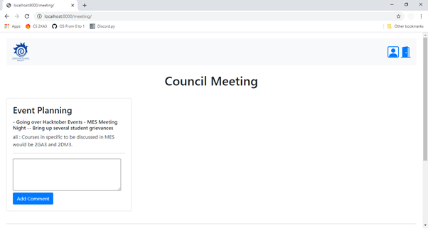

# mcssmeetings
### Created a Platform to host meetings for the McMaster CS Society.
Written Using the Python Django Framework with HTML, CSS and Javascript.
Currently, you'd need to be a user to access the website as the website does contain sensitive society information.

### Login View
Currently, Users can only be created through the console by the administrator (me). If you'd like to take a look around, you can email me at ali.murtaza.am@gmail.com and we could work something out. Again as I've mentioned, the website does contain sensitive information so this would be done on a case to case basis.

### Home view

### Meeting View

